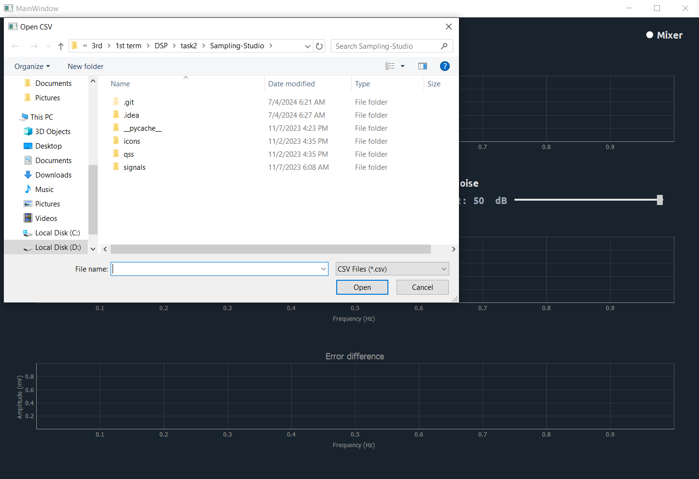
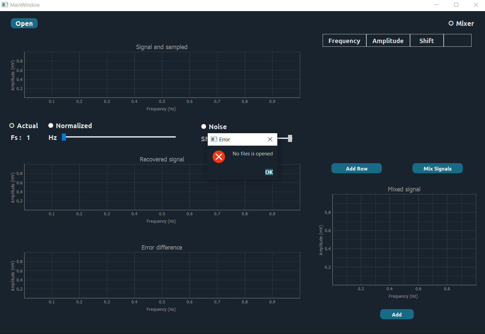
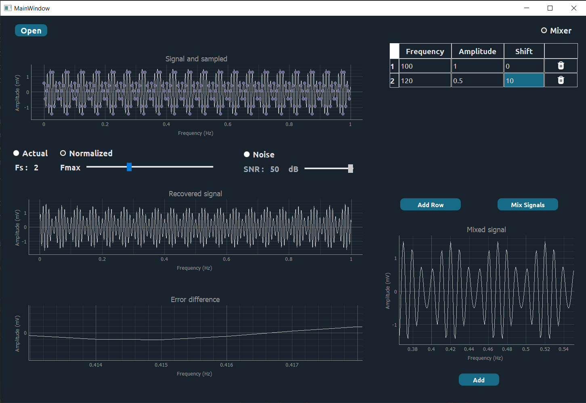
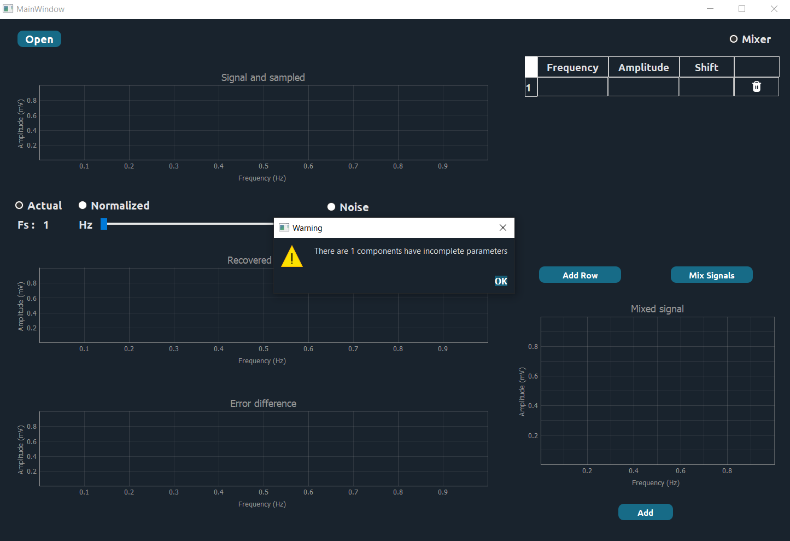
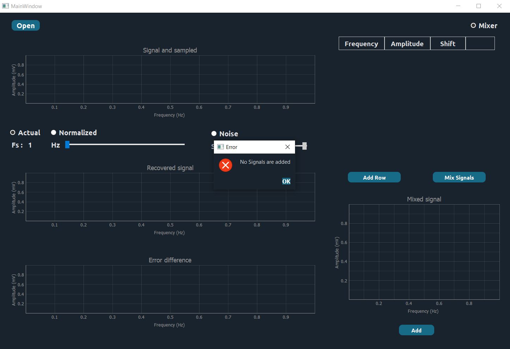
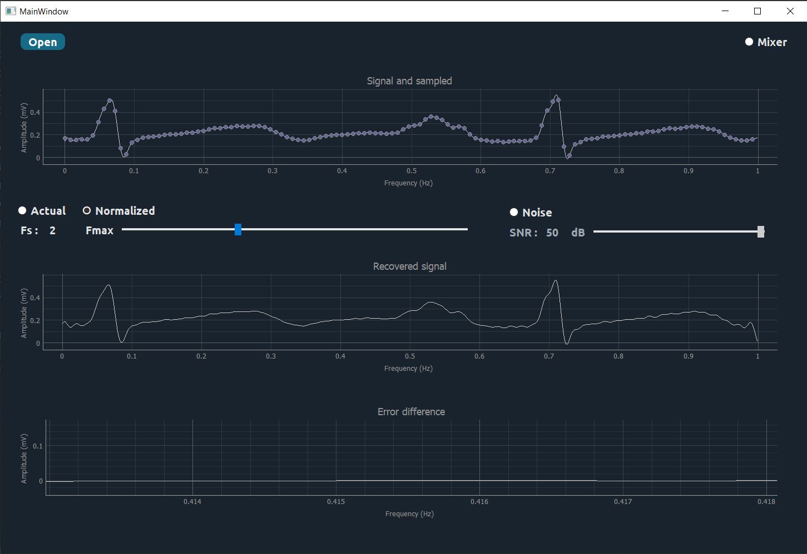
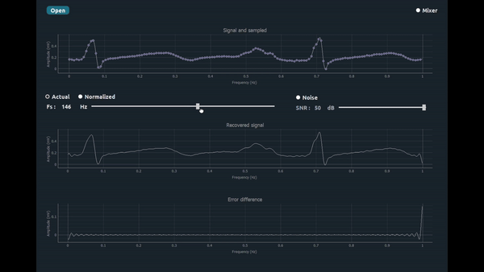
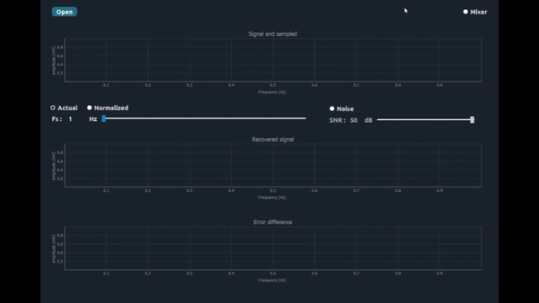
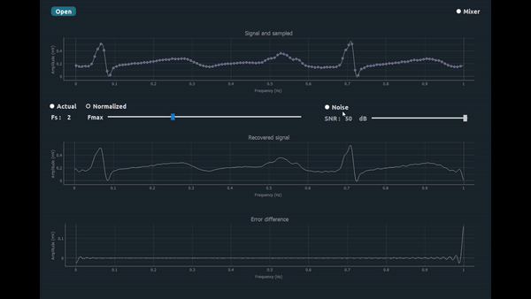

# SAMPLING-STUDIO

## Description

This application provides a graphical interface for signal sampling, allowing users to sample, visualize, and manipulate signals. It supports signal mixing, noise addition, and frequency resampling using PyQt5 and PyQtGraph for the GUI and plotting respectively.

## Table of Contents

1. [Description](#description)
2. [Installation](#installation)
3. [Features](#features)
4. [Dependencies](#dependencies)
5. [Usage](#usage)
    - [Loading Signal Data](#loading-signal-data)
    - [Mixing Signals](#mixing-signals)
    - [Adjusting SNR](#adjusting-snr)
    - [Frequency Resampling](#frequency-resampling)
6. [Plot Descriptions](#plot-descriptions)
7. [UI Elements](#ui-elements)
8. [Developer Notes](#developer-notes)
9. [Acknowledgments](#acknowledgments)
10. [Contributors](#contributors)

## Installation

1.Clone the repository:

```bash
# Clone the repository
git clone https://github.com/your-repo/signal-processing-app.git

# Navigate to the project directory
cd signal-processing-app
```

2.Install the required dependencies:

```bash
# Install the requirements
pip install -r requirements.txt
```

## Features

- Load signal data from CSV files

 

- Mix multiple signals with customizable frequency, amplitude, and shift

   

- Add noise to signals with adjustable Signal-to-Noise Ratio (SNR)
- Resample signals with adjustable frequency sliders



- Visualize original, sampled, recovered signals, and error differences

## Dependencies

- PyQt5
- PyQtGraph
- NumPy
- Pandas

## Usage

### Loading Signal Data

1. Click the `Open` button to load a signal from a CSV file.


 
### Mixing Signals

1. If you want to synthesize a signal, Add signal components by entering frequency, amplitude, and shift values in the table.
2. Click the `Mix` button to compose the signals.
3. Click the `Add to Main Plot` button to add the mixed signal to the main plot.



### Adjusting SNR

1. Enable noise addition by selecting the `Noise` radio button.
2. Use the SNR slider to adjust the Signal-to-Noise Ratio.
3. The plots will update automatically.

### Frequency Resampling

1. Adjust the frequency slider to resample the signal.
2. The plots will update automatically to reflect the new sampling rate.




## Plot Descriptions

- **Signal and Sampled Plot**: Shows the original and resampled signal.
- **Recovered Signal Plot**: Displays the recovered signal after resampling.
- **Error Difference Plot**: Visualizes the difference between the original and recovered signal.
- **Mixed Signal Plot**: Shows the composed signal from the table of signals.

## UI Elements

- **Plot Widgets**: Four main plot areas for signal visualization.
- **Table of Signals**: Allows users to input frequency, amplitude, and shift values for signal components.
- **Buttons**:
  - `Mix`: Composes the signal from the table.
  - `Add to Main Plot`: Adds the mixed signal to the main plot.
  - `Open`: Opens a CSV file for signal data.
  - `Add Row`: Adds a new row to the signal table.
  - `Delete Row`: Deletes a selected row from the signal table.
- **Sliders**:
  - `Frequency`: Adjusts the resampling frequency.
  - `SNR`: Adjusts the Signal-to-Noise Ratio.

## Developer Notes

- Ensure that the `res_rc` and `sampler` modules are properly imported and available in the project directory.
- The application uses `QPropertyAnimation` for smooth sidebar transitions.
- Validators are set for input fields to ensure proper data types are entered.

## Acknowledgments

- PyQt5 for the GUI framework.
- PyQtGraph for the plotting capabilities.
- Contributors and community for support and libraries.

## Contributors <a name = "contributors"></a>

<table>
  <tr>
    <td align="center">
    <a href="https://github.com/AbdulrahmanGhitani" target="_black">
    
    <br />
    <sub><b>Abdulrahman Shawky</b></sub></a>
    </td>
<td align="center">
    <a href="https://github.com/omarnasser0" target="_black">
    
    <br />
    <sub><b>Omar Abdulnasser</b></sub></a>
    </td>
         <td align="center">
    <a href="https://github.com/AhmedKamalMohammedElSayed" target="_black">
    
    <br />
    <sub><b>Ahmed Kamal</b></sub></a>
    </td>
         <td align="center">
    <a href="https://github.com/AbdullahOmran" target="_black">
    
    <br />
    <sub><b>Abdullah Omran</b></sub></a>
    </td>
      </tr>
 </table>
